<p align="center">
  
</p>

# Monaco TextArea Bookmarklet

Convert any textarea into a full-featured Monaco Editor (VS Code's editor engine) with a single click!

## 📌 Installation

### 🖱️ Drag and Drop

You can open and drag the link from the [demo page](https://kariudo.dev/monoco-textarea-bookmarklet/demo.html) directly to your bookmarks bar.

### 👋🏻 Manually

Or, just add this link to your bookmarks bar:

```javascript
javascript:(function(){if(window.monacoEditorInstances){var existing=window.monacoEditorInstances.find(function(inst){return inst.textarea===document.activeElement;});if(existing){alert('This textarea already has Monaco editor active');return;}}var t=document.activeElement;if(!t||t.tagName!=='TEXTAREA'){alert('Please focus a textarea first');return;}var originalDisplay=t.style.display;var originalVisibility=t.style.visibility;var originalPosition=t.style.position;var originalWidth=t.style.width;var originalHeight=t.style.height;var computedStyle=window.getComputedStyle(t);var w=t.offsetWidth;var h=Math.max(t.offsetHeight,300);t.style.position='absolute';t.style.visibility='hidden';t.style.pointerEvents='none';var wrapper=document.createElement('div');wrapper.style.position='relative';wrapper.style.width=w+'px';wrapper.style.height=h+'px';t.parentNode.insertBefore(wrapper,t);wrapper.appendChild(t);var c=document.createElement('div');c.style.cssText='position:absolute;top:0;left:0;width:100%;height:100%;border:1px solid #ccc;box-sizing:border-box;';wrapper.appendChild(c);var fab=document.createElement('button');fab.innerHTML='✕';fab.title='Close Monaco Editor';fab.style.cssText='position:absolute;top:8px;right:8px;width:32px;height:32px;border-radius:50%;background:#007acc;color:white;border:none;font-size:18px;cursor:pointer;z-index:1000;box-shadow:0 2px 8px rgba(0,0,0,0.3);transition:background 0.2s;';fab.onmouseover=function(){this.style.background='#005a9e';};fab.onmouseout=function(){this.style.background='#007acc';};wrapper.appendChild(fab);if(!window.monacoEditorInstances){window.monacoEditorInstances=[];}var instance={textarea:t,wrapper:wrapper,container:c,fab:fab,editor:null,originalStyles:{display:originalDisplay,visibility:originalVisibility,position:originalPosition,width:originalWidth,height:originalHeight}};window.monacoEditorInstances.push(instance);var loadMonaco=function(){if(!document.getElementById('monaco-editor-css')){var l=document.createElement('link');l.id='monaco-editor-css';l.rel='stylesheet';l.href='https://cdnjs.cloudflare.com/ajax/libs/monaco-editor/0.44.0/min/vs/editor/editor.main.min.css';document.head.appendChild(l);}if(window.monaco){initEditor();return;}if(window.monacoLoading){var checkMonaco=setInterval(function(){if(window.monaco){clearInterval(checkMonaco);initEditor();}},100);return;}window.monacoLoading=true;var sc=document.createElement('script');sc.src='https://cdnjs.cloudflare.com/ajax/libs/monaco-editor/0.44.0/min/vs/loader.min.js';sc.onload=function(){require.config({paths:{'vs':'https://cdnjs.cloudflare.com/ajax/libs/monaco-editor/0.44.0/min/vs'}});require(['vs/editor/editor.main'],function(){window.monacoLoading=false;initEditor();});};document.body.appendChild(sc);};var initEditor=function(){var e=monaco.editor.create(c,{value:t.value,language:'javascript',theme:'vs-dark',automaticLayout:true,minimap:{enabled:false},scrollBeyondLastLine:false});instance.editor=e;var syncToTextarea=function(){var newValue=e.getValue();if(t.value!==newValue){t.value=newValue;var evt=new Event('input',{bubbles:true,cancelable:true});t.dispatchEvent(evt);var changeEvt=new Event('change',{bubbles:true,cancelable:true});t.dispatchEvent(changeEvt);if(typeof angular!=='undefined'){var ngEvt=new Event('ng-change',{bubbles:true});t.dispatchEvent(ngEvt);var scope=angular.element(t).scope();if(scope){scope.$apply();}}}};e.onDidChangeModelContent(function(){syncToTextarea();});var removeEditor=function(){if(instance.editor){instance.editor.dispose();}wrapper.parentNode.insertBefore(t,wrapper);wrapper.remove();t.style.display=instance.originalStyles.display||'';t.style.visibility=instance.originalStyles.visibility||'';t.style.position=instance.originalStyles.position||'';t.style.width=instance.originalStyles.width||'';t.style.height=instance.originalStyles.height||'';t.style.pointerEvents='';var idx=window.monacoEditorInstances.indexOf(instance);if(idx>-1){window.monacoEditorInstances.splice(idx,1);}};fab.onclick=removeEditor;};loadMonaco();})();
```

**To create the bookmarklet:**
1. Create a new bookmark in your browser
2. Name it "Monaco Editor" (or whatever you prefer)
3. Paste the entire JavaScript code above as the URL
4. Save it

## 📖 How to Use

1. **Navigate** to any page with a textarea
2. **Focus** the textarea by clicking inside it
3. **Click** the bookmarklet in your bookmarks bar
4. **Edit** with Monaco Editor overlaying the textarea
5. **Close** by clicking the ✕ button in the top-right corner to restore the original textarea

## ✨ Features

- ✅ Full-featured Monaco Editor (VS Code's editor engine)
- ✅ Syntax highlighting for JavaScript (customizable)
- ✅ Dark theme for comfortable coding
- ✅ Framework-compatible (Angular, React, Vue, etc.)
- ✅ Keeps textarea in DOM - only hides it visually
- ✅ Dispatches proper `input`, `change`, and `ng-change` events
- ✅ Close button (✕) to toggle back to original textarea
- ✅ Support for multiple editors on the same page
- ✅ Auto-resizes with the container
- ✅ Works with form submissions

## 🔧 How It Works

### Framework Compatibility

The bookmarklet is designed to work seamlessly with modern JavaScript frameworks:

- The textarea **remains in the DOM** but is made invisible using `visibility: hidden`
- Monaco Editor is **overlaid on top** in a wrapper element
- Every change dispatches `input`, `change`, and `ng-change` events
- For Angular specifically, it also triggers `$scope.$apply()` if available
- This ensures all framework bindings and validations continue working

### Architecture

```mermaid
graph TD
    subgraph W["Wrapper – position: relative"]
        T["Textarea (hidden)"]
        M["Monaco Container<br/>(absolute, overlaid)"]
        X["✕ Close Button"]
    end

    style W fill:#f8f8f8,stroke:#333,stroke-width:2px
    style T fill:#ffffff,stroke:#999,stroke-dasharray:3 3
    style M fill:#eef5ff,stroke:#339
    style X fill:#ffefef,stroke:#933

```



## 🎨 Customization

The editor is configured for JavaScript with a dark theme by default. To customize, edit the bookmarklet code and look for these settings:

### Language

```javascript
language: 'javascript'
```

Available options: `'html'`, `'css'`, `'python'`, `'json'`, `'markdown'`, `'typescript'`, `'xml'`, `'sql'`, and many more.

### Theme

```javascript
theme: 'vs-dark'
```

Available options:
- `'vs'` - Light theme
- `'vs-dark'` - Dark theme (default)
- `'hc-black'` - High contrast dark theme

### Editor Options

You can modify the editor configuration in the `monaco.editor.create()` call:

```javascript
monaco.editor.create(container, {
    value: textarea.value,
    language: 'javascript',
    theme: 'vs-dark',
    automaticLayout: true,
    minimap: { enabled: false },
    scrollBeyondLastLine: false,
    // Add more options here
    fontSize: 14,
    lineNumbers: 'on',
    wordWrap: 'on',
    // See Monaco Editor documentation for all options
});
```

## 🚀 Use Cases

- Editing code in GitHub/GitLab issue comments
- Writing SQL queries in database admin panels
- Editing JSON in API testing tools
- Writing scripts in CMS textareas
- Improving code editors in learning platforms
- Any web form with a textarea that needs better editing

## ⚠️ Limitations

- Only works with standard textareas (not rich text editors or contenteditable elements)
- Requires internet connection to load Monaco from CDN (first use only)
- May not work on pages with strict Content Security Policies
- May not work with fields inside of iFrames or similar nested sub-documents
- Monaco Editor is ~2MB and loads from CDN on first use

## 🔒 Privacy & Security

- No data is sent to external servers
- Monaco Editor is loaded from Cloudflare's CDN
- All editing happens locally in your browser
- The bookmarklet only runs when you explicitly click it

## 📝 License

See [License](./LICENSE)

## 🤝 Contributing

Suggestions and improvements are welcome! Feel free to open an issue or submit a pull request.

## 🙏 Credits

- [Monaco Editor](https://microsoft.github.io/monaco-editor/) by Microsoft
- Inspired by the need for better textarea editing across the web and my desire to stop copy pasting code in textarea
